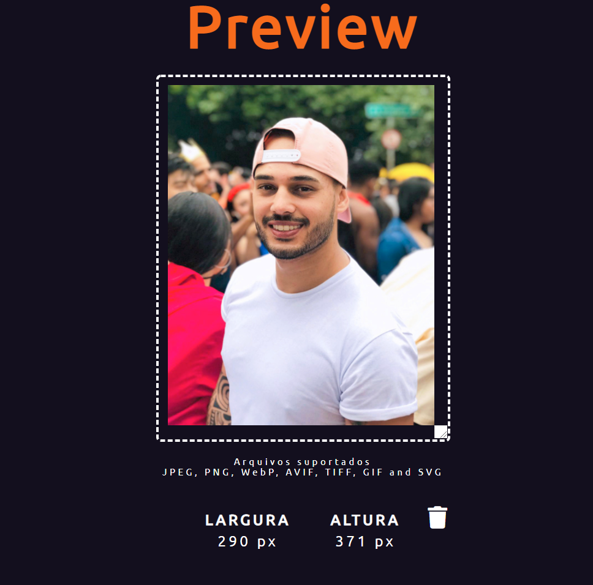

# <p align="center"> PICS EDITOR</p>

<p align="center">
  
</p>


## About
Pics Editor is an application to resize images by using Node.js

## How to run it:

### Prerequisites
- Node.js >= 12.13.0

- Clone the repository https://github.com/JuniorMacedo91/pics-editor.git

### Installation

```
 npm install sharp
 npm install express
```

### Dependecies:

```
sharp
express
```

It is quite simple to use it.

## How to use:
 - Open app https://picseditor.netlify.app/public/
 - Choose a picture and drag it to the temporary file in the IDE;
 - Hold the scroll arrow in the bottom right;
 - Resize it by dragging from bottom right to top;
 - Open resize.js file;
 - In the path variable insert the image's name after ./temporary/;
 - Put the width and height size as showed in the preview;
 - Open the terminal and write NODE RESIZED;
 - The new picture will be displayed in the resized file;
 
 > SUPPORTED FILES: JPEG, PNG, WebP, AVIF, TIFF, GIF and SVG images;

## Features

- [x] Upload image;
- [x] Resize image;
- [x] Save into a resized file;
- [x] Delete temporary image;


## Javascript main challenge:
- How to create a file reader;
- To understand the difference between:
  - offsetHeight and offsetWidth; 
  - clientHeight and clientWidth;
  - scrollHeight and scrollWidth;
- Creat elements by creatElement();

## Node.js main challenge:
- Learn how to deal with Sharp module. A library from Node.js to process images;
- How to structure functions in accordance with documentation;
- To run a command in the terminal window;

## Skill

[](https://github.com/JuniorMacedo91)
[](https://github.com/JuniorMacedo91)
[](https://github.com/JuniorMacedo91)
[](https://github.com/JuniorMacedo91)
[](https://github.com/JuniorMacedo91)
[](https://github.com/JuniorMacedo91)
